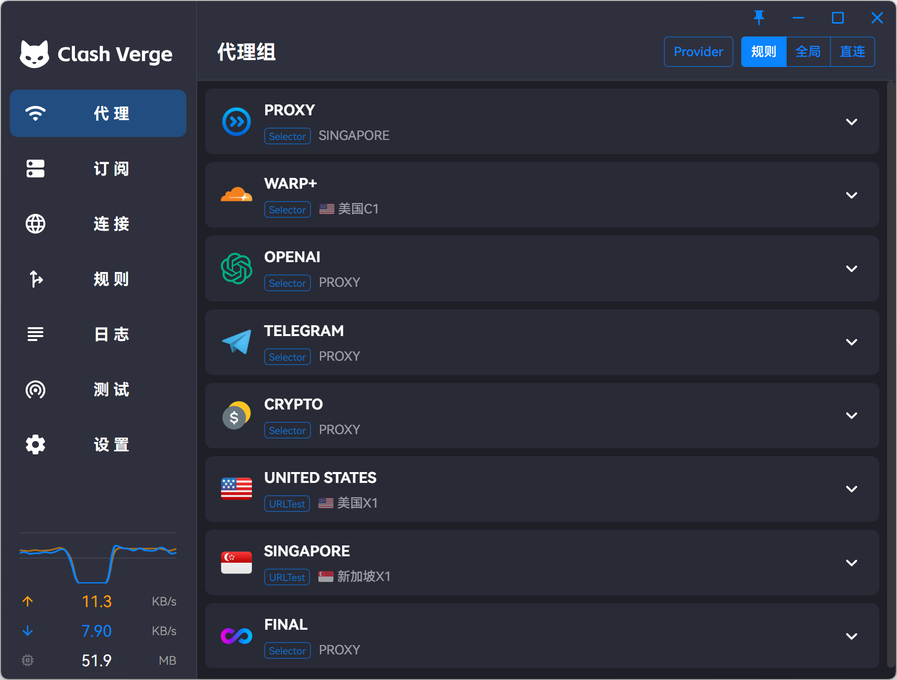
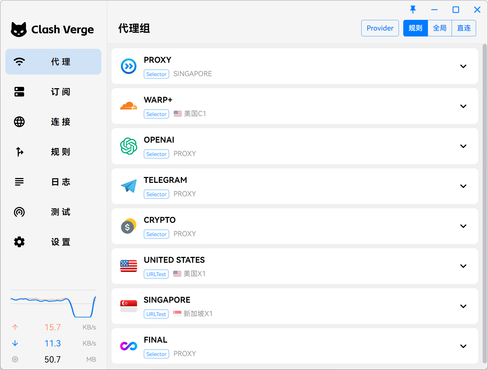

<h1 align="center">
  
   
  <a href="https://github.com/zzzgydi/clash-verge" target="_blank">Clash Verge</a> 的延续
   
</h1>
<h3 align="center">基于 <a href="https://github.com/tauri-apps/tauri" target="_blank">Tauri</a> 的 Mihomo GUI</h3>
<a href="https://t.me/clash_verge_rev" target="_blank">
Telegram 群组:@clash_verge_rev
</a>

## 特性

- 内置[Clash.Meta(mihomo)](https://github.com/MetaCubeX/mihomo)内核，并支持切换 `Alpha` 版本内核。
- 简洁美观的用户界面，支持自定义主题颜色、代理组/托盘图标以及 `CSS Injection`。
- 配置文件管理和增强（Merge 和 Script），配置文件语法提示。
- 系统代理和守卫、`TUN(虚拟网卡)` 模式。
- 可视化节点和规则编辑
- WebDav 配置备份和同步

## 预览

| 深色                               | 浅色                                |
| ---------------------------------- | ----------------------------------- |
|  |  |

## 机场推荐

[优信云 —— 技术流机场](https://www.优信云.com/#/register?code=JRtE5uIV)
- **实力老牌机场**全新推出的高速专线服务，强势支持 Netflix、TVB 等海外流媒体解锁，同时完美兼容 ChatGPT 使用。
- 覆盖全平台客户端，无论是 Windows、Mac、Linux，还是 Android、iOS，都能轻松畅享高速网络体验！
- **支持 支付宝、微信支付在线支付。**
- 所有套餐都有固定的流量限制。但是，所有套餐都是不限速使用。
- 多个级别套餐分别有 50GB、200GB和 高达5TB等，满足您不同场景需求使用。
- 提供Telegram、邮件、工单7x24小时客服支持。
- 站内软件及使用教程完善。

### 优信云套餐价格

| **套餐** | **月流量** | **在线设备数** | **价格** |                           **购买**                           |
| :------: | :--------: | :------------: | :------: | :----------------------------------------------------------: |
| 休闲款套餐 |   50 GB    |      2      | 15元/月  | [注册购买](https://www.优信云.com/#/register?code=JRtE5uIV) |
| 运动款套餐 |   100 GB   |      3      | 20元/月  | [注册购买](https://www.优信云.com/#/register?code=JRtE5uIV) |
| 商务款套餐 |   200 GB   |      4     | 30元/月  | [注册购买](https://www.优信云.com/#/register?code=JRtE5uIV) |
| 专业款套餐 |   350 GB   |      6      | 40元/月  | [注册购买](https://www.优信云.com/#/register?code=JRtE5uIV) |
| 旗舰款套餐-大流量 |  600 GB   |      6      | 50元/月 | [注册购买](https://www.优信云.com/#/register?code=JRtE5uIV) |

## 赞助

<iframe src="https://github.com/sponsors/clash-verge-rev/card" title="Sponsor clash-verge-rev" height="100" width="600" style="border: 0;"></iframe>

## 致谢

Clash Verge rev 项目基于/借鉴如下项目:

| 项目地址                                                              | 项目简介                                                                         |
| --------------------------------------------------------------------- | -------------------------------------------------------------------------------- |
| [clash-verge](https://github.com/zzzgydi/clash-verge)                 | A Clash GUI based on tauri. Supports Windows, macOS and Linux.                   |
| [Clash.Meta(mihomo)](https://github.com/MetaCubeX/mihomo)             | A rule-based tunnel in Go.                                                       |
| [Clash for Windows](https://github.com/Fndroid/clash_for_windows_pkg) | A Windows/macOS GUI based on Clash.                                              |
| [Tauri](https://github.com/tauri-apps/tauri)                          | Build smaller, faster, and more secure desktop applications with a web frontend. |
| [React](https://github.com/facebook/react)                            | The library for web and native user interfaces.                                  |
| [MUI](https://github.com/mui/material-ui)                             | Ready-to-use foundational React components, free forever.                        |
| [Vite](https://github.com/vitejs/vite)                                | Next generation frontend tooling. It's fast!                                     |

## License

GPL-3.0 License. See [License here](https://github.com/clash-verge-rev/clash-verge-rev/blob/main/LICENSE) for details.

::: tip 🎉 节点推荐

🚀 [优信云](https://www.优信云.com/#/register?code=JRtE5uIV)：IEPL/IPLC 高速专线，￥15.00/月
:::