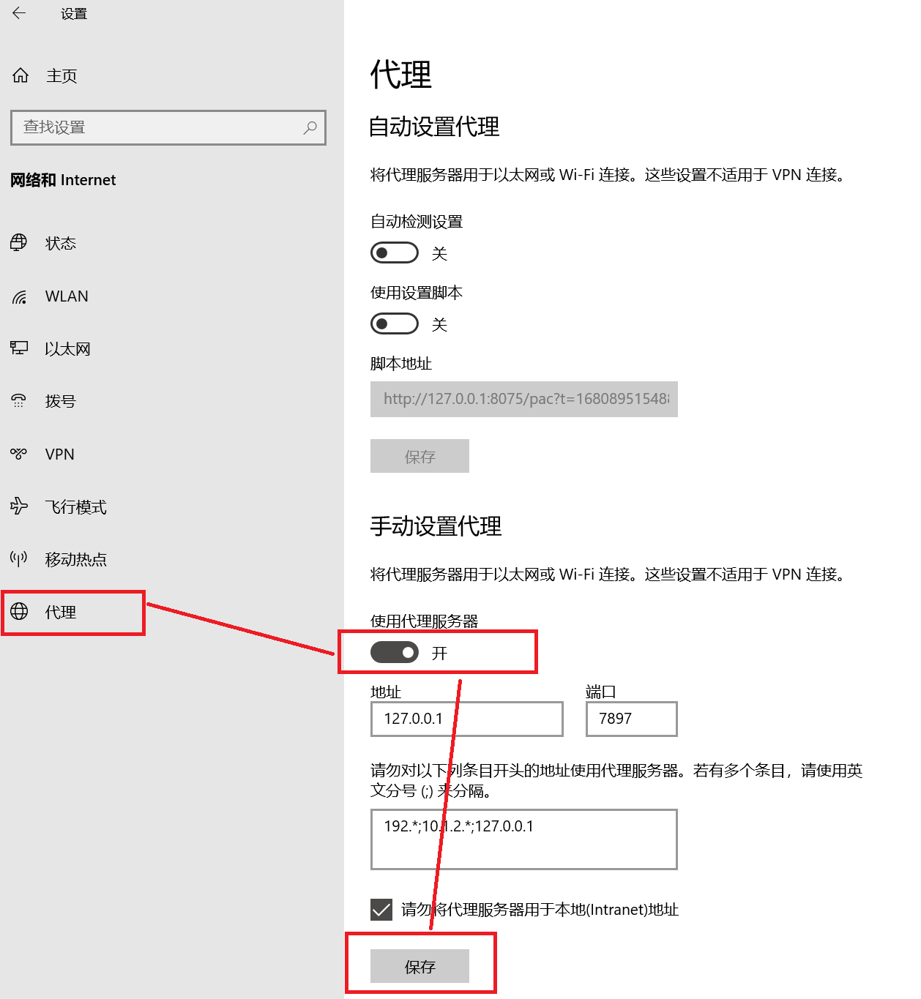
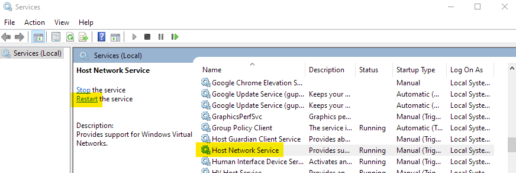
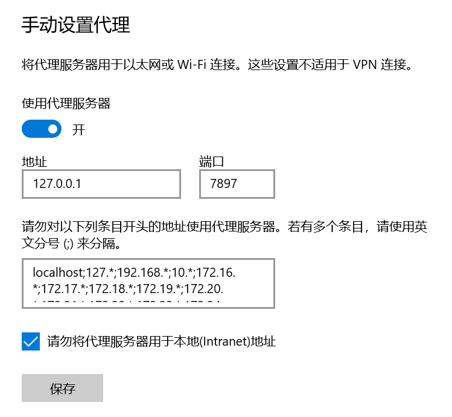
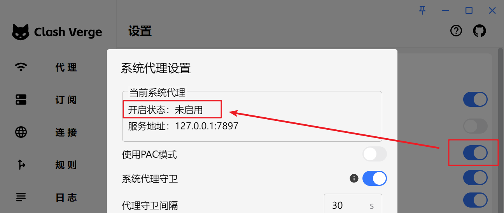
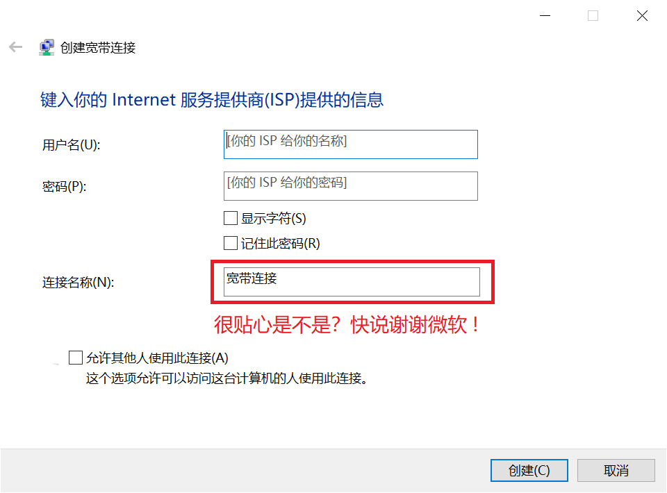

# Clash Verge Rev常见问题解决指南
## 打开TUN模式后网络异常

问题原因

- 系统中可能有多个网卡 / 网段与配置中的规则冲突

解决方案

- 打开网络设置，删除多余网卡，参见[Issue#2400](https://github.com/clash-verge-rev/clash-verge-rev/issues/2400)

## 此应用无法在你的电脑上运行


99.99% 是因为你下载错了文件，请检查你是否下载了对应你机器架构的安装包。

对于大部分人来说，应该下载 `x64` 版本，而不是 `arm64` 版本。

## 无法启动/不显示界面/闪退/只有托盘图标

问题原因

- Tauri 框架依赖于 `WebView2`。如果卸载或禁用了 `WebView2` ,将无法显示界面。具体表现为: 程序可以启动，但是点击托盘菜单没有反应。

解决方案

- 如果是利用第三方软件禁用了 `Edge`，请检查是否同时禁用了 `WebView2`，将 `WebView2` 取消禁用。
- 如果是卸载了 `WebView2`，可以[下载 WebView2 安装包](https://developer.microsoft.com/zh-cn/microsoft-edge/webview2/#download)，重新安装 WebView2。
- 如果是已安装 `WebView2` 但仍无法打开面板，请尝试在 [Release](https://github.com/clash-verge-rev/clash-verge-rev/releases/latest) 下载内置了 `WebView2` 的版本（带有 `fixed_webview2` 字样的安装包）。

## 闪退

问题原因

- 安装有**360、金山毒霸**等杀毒软件拦截[服务模式](../guide/term.md#_2)安装。

解决方案

- 不要使用**中国的杀毒软件**。

## WebView2 无法正常安装

问题原因

- 可能是你的 Windows 系统关闭了自动更新。

解决方案

- 打开自动更新。

- 若实在无法安装 WebView2，可以尝试在 [Release](https://github.com/clash-verge-rev/clash-verge-rev/releases/latest) 下载内置了 `WebView2` 的版本（带有 `fixed_webview2` 字样的安装包）。

## Windows 7 无法使用

- 已不再支持 `Windows7`


## 静默启动失效

> 配置了静默启动，依然弹出程序窗口。

- 如果出现任务管理器中有**两个启动项**，或者开机启动时静默启动失效。请用**管理员权限**启动软件后**开关一次**开机启动设置，即可删除多余的启动项。
- 如果平时一直是使用管理员权限运行的软件，那就用**普通用户权限**运行软件后**开关一次**开机启动设置，删除多余启动项后，后续不会再出现这个问题。

## 自启动失效

- 原因：每次安装的时候会把之前的(旧的)启动项清除掉。
- 办法：重新再开关一次开机启动的开关就行了。

> 这样设计的理由：
> 
> 1.老版本的应用名称和最新版有点区别（老版本叫clash verge，新版本多一个dash: clash-verge）如果不清理启动项，就会导致某些报错。
> 
> 2.有些用户安装路径混乱，会产生启动多个进程的情况，导致程序异常

## 不打开 Clash 无法使用网络

> 不使用 Clash 就无法访问网络，打开 Clash 后才能正常访问网络。

- 可能原因: 由于未知原因（如断电、蓝屏或其他原因），系统代理未能正确地被关闭（即使 Clash 已退出），但实际上 Windows 的系统代理设置开关仍然开着。
- 解决办法: 打开 `Windows 设置` -> `网络和 Internet` -> `代理` -> `手动设置代理`，关闭 `使用代理服务器`。



## 无法选中订阅

> 日志报错: An attempt was made to access a socket in a way forbidden by its access permissions.

系统服务没有开启，执行下列命令开启服务。

```
net stop hns
net start hns
```

或者手动打开服务设置，重新启动 `Hot Network Service`。


## 应用内更新后自动安装到了 C 盘默认目录/应用内更新后仍然是旧版本

问题原因

- 之前的某些版本升级有 Break Change，如果从很旧的版本升级会导致无法识别已安装目录。

解决方案

- 手动卸载系统中存在的多个 Clash Verge Rev，然后重新安装最新版本，后续更新不会出现此类问题。

## Windows 系统 UWP 应用(如微软商店等)无法使用代理

问题原因

- Windows 系统 UWP 应用存在沙盒机制，正常情况下无法访问 localhost（即无法访问回环地址），而代理程序在本地端口监听请求。因此需要解除 UWP 应用的回环访问限制。

解决方案

- 打开 `Clash 设置` -> `UWP 工具` ，找到需要解除限制的 UWP 程序。
- 勾选需要解除限制的 UWP 程序后，点击工具顶部的 `Save Changes` 按钮保存修改。

## Windows 宽带拨号无法使用系统代理（2.0 版以后无此问题）

> Windows 的 `Windows 设置` -> `网络和 Internet` -> `代理` 中显示系统代理已经开启，且指向了正确的端口。Clash Verge Rev 的 `设置` -> `系统代理` 小齿轮界面中，当前系统代理的开启状态却显示为未启用。

|  |  |
| ------------------------------------------------------------------ | ----------------------------------------------------------------------- |

解决办法

- 下载安装最新版本。或：
- 打开注册表`HKEY_CURRENT_USER\Software\Microsoft\Windows\CurrentVersion\Internet Settings\Connections`删除乱码名称的条目([引用博客](https://myth.cx/p/windows-proxy/))。
- **删除**原有的宽带拨号设置，然后**重新创建**宽带拨号设置（<font color="red">连接名称不要使用中文</font>）。



## 版本更新后图标没有变化/老版图标/图标白色方块

- 问题原因: Windows 需要更新图标缓存文件，并重启资源管理器。

- 解决办法: 点击按钮复制下列代码，`Win + R` 输入 `cmd` 确定，右键粘贴命令并执行。或手动删除用户目录下的该文件，并重启资源管理器。

```bash
del /A "%userprofile%\AppData\Local\IconCache.db" 2>nul & taskkill /f /im explorer.exe & start explorer.exe
```

## 找不到 VCRUNTIMEXXX.dll，无法继续执行代码（2.0版本后安装器会自动检测并安装vc runtime）

- 问题原因：操作系统缺少 VC 运行环境所需的库。
- 解决方案：下载并安装 VC 运行库。


    | 运行库 | 下载地址 |
    | ----- | ------- |
    | `vc_redist.x64.exe` | [vc_redist.x64.exe](https://aka.ms/vs/17/release/vc_redist.x64.exe) |


    | 运行库 | 下载地址 |
    | ----- | ------- |
    | `vc_redist.x86.exe` | [vc_redist.x86.exe](https://aka.ms/vs/17/release/vc_redist.x86.exe) |


    | 运行库 | 下载地址 |
    | ----- | ------- |
    | `vc_redist.arm64.exe` | [vc_redist.arm64.exe](https://aka.ms/vs/17/release/vc_redist.arm64.exe) |
::: tip 🎉 节点推荐

🚀 [优信云](https://www.优信云.com/#/register?code=JRtE5uIV)：IEPL/IPLC 高速专线，￥15.00/月
:::