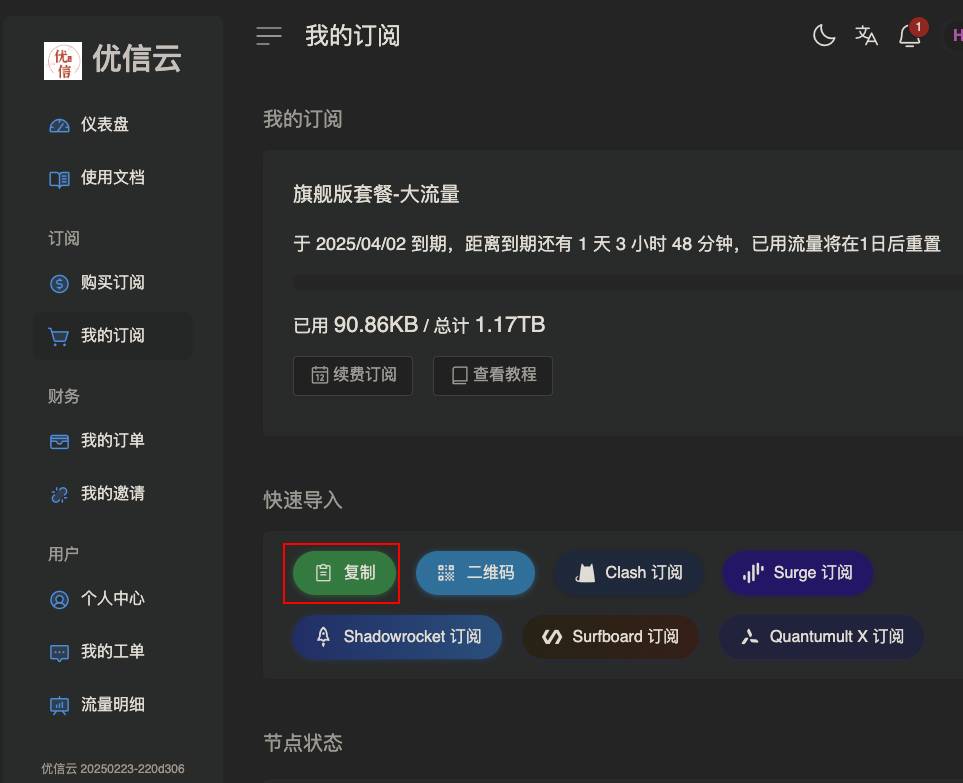
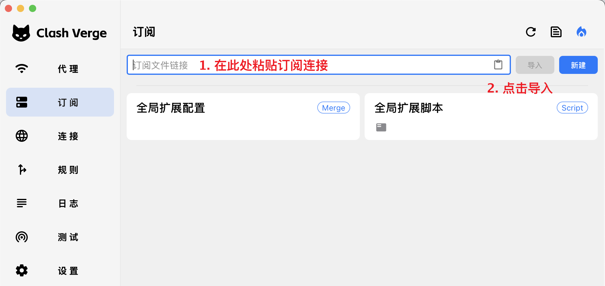
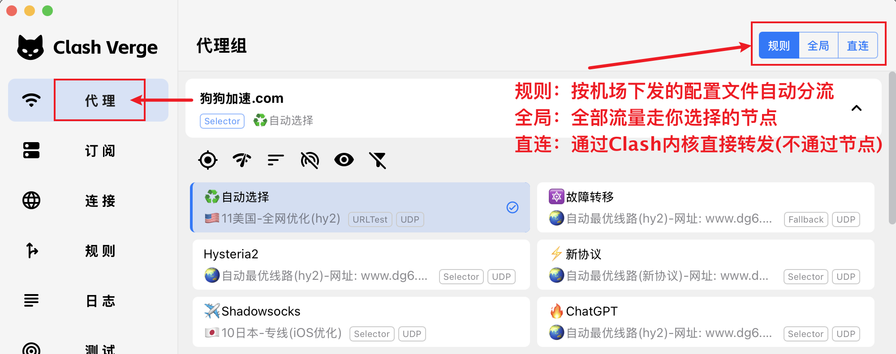
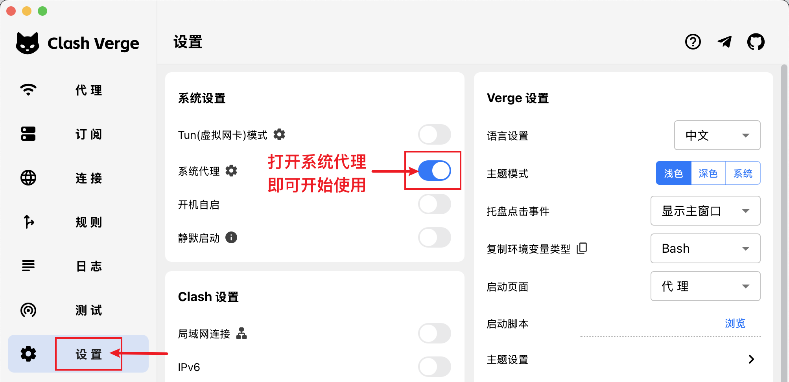

# Clash Verge Rev 教程 - 快速上手
::: tip ⚠️注意
- 如果你不清楚你的电脑系统架构，请下载 `x64` 架构文件（目前多数 Windows 电脑使用该架构）。
- 2.0版开始，首次启动软件会自动尝试卸载和安装服务(uninstall-service和install-service)，必须同意安装，否则无法正常运行Mihomo内核。
- **Windows 7** 用户请先升级至Win10/11，或改为使用Linux桌面发行版，现版本已经不再支持Windows7。
- 带有 `fix_webview2` 字样的安装包为内置 `Webview2` 环境版本（该文件体积比普通安装包大，仅用于当系统缺少且[无法安装WebView2](../faq/windows.md#webview2)环境时使用，当你无法正常打开面板也可以试试这个版本）。
- 目前不会推出Portable便携版，如有需要请自行下载代码构建。
:::
## 下载与安装

参见 [下载与安装](../install/install.md)

::: tip 🎉 节点推荐

🚀 [优信云](https://www.优信云.com/#/register?code=JRtE5uIV)：IEPL/IPLC 高速专线，￥15.00/月
:::

## 导入订阅

通过机场或者自建订阅导入节点和配置文件，以下以"[优信云](https://www.优信云.com/#/register?code=JRtE5uIV)"订阅演示：

## 选择节点和模式

## 打开代理(或开启 Tun 模式)

> **系统代理**：（原理：通过上方开关自动修改操作系统的代理设置）能处理大部分通过浏览器的科学上网需求。

> **Tun 模式**：(使用前请确保你已阅读相关教程)在系统中安装虚拟网卡，以接管不支持“系统代理”的程序（例如游戏和命令行）。
