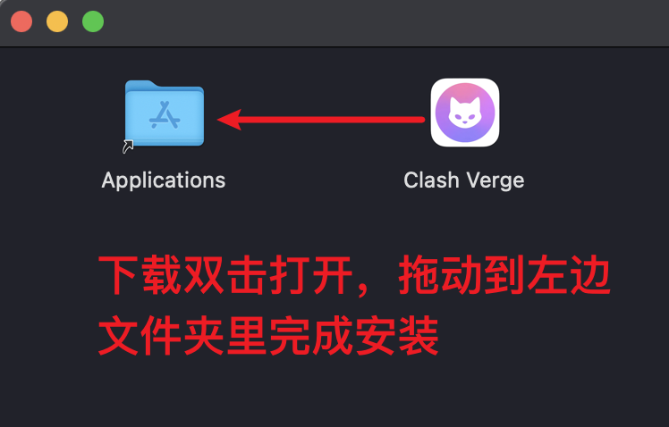

# Clash Verge Rev 下载安装指南
> [!warning]
    如果你是第一次使用 Clash Verge Rev，请先阅读[快速入门](/guide/quickstart)。
## Windows

::: tip ⚠️注意
- 如果你不清楚你的电脑系统架构，请下载 `x64` 架构文件（目前多数 Windows 电脑使用该架构）。
- 2.0版开始，首次启动软件会自动尝试卸载和安装服务(uninstall-service和install-service)，必须同意安装，否则无法正常运行Mihomo内核。
- **Windows 7** 用户请先升级至Win10/11，或改为使用Linux桌面发行版，现版本已经不再支持Windows7。
- 带有 `fix_webview2` 字样的安装包为内置 `Webview2` 环境版本（该文件体积比普通安装包大，仅用于当系统缺少且[无法安装WebView2](../faq/windows.md#webview2)环境时使用，当你无法正常打开面板也可以试试这个版本）。
- 目前不会推出Portable便携版，如有需要请自行下载代码构建。
:::


::: tip 🎉 节点推荐

🚀 [优信云](https://www.优信云.com/#/register?code=JRtE5uIV)：IEPL/IPLC 高速专线，￥15.00/月
:::

    
  | 系统架构 | 下载地址 |
  | -------- | -------- |
  | x64 | [x64安装包](https://github.com/clash-verge-rev/clash-verge-rev/releases/download/v2.2.2/Clash.Verge_2.2.2_x64-setup.exe)    [内置Webview2版本](https://github.com/clash-verge-rev/clash-verge-rev/releases/download/v2.2.2/Clash.Verge_2.2.2_x64_fixed_webview2-setup.exe)|
  | x86 |  |
  | arm64 | [arm64安装包](https://github.com/clash-verge-rev/clash-verge-rev/releases/download/v2.2.2/Clash.Verge_2.2.2_arm64-setup.exe)  [内置Webview2版本](https://github.com/clash-verge-rev/clash-verge-rev/releases/download/v2.2.2/Clash.Verge_2.2.2_arm64_fixed_webview2-setup.exe)|

  网盘下载地址：[https://wwic.lanzouo.com/b0zjttvgf](https://wwic.lanzouo.com/b0zjttvgf)   密码:68xi

## Linux

### Debian/Ubuntu/Deepin

> [!warning]
    Ubuntu `24.04` 需要安装额外依赖，详见[常见问题](../faq/linux.md)。

| 系统架构 | 下载地址 |
| -------- | ------------------------------------------ |
| x64      |  [x64安装包](https://github.com/clash-verge-rev/clash-verge-rev/releases/download/v2.2.2/Clash.Verge_2.2.2_amd64.deb)  |
| x86      |    |
| arm64    |  [arm64安装包](https://github.com/clash-verge-rev/clash-verge-rev/releases/download/v2.2.2/Clash.Verge_2.2.2_arm64.deb)  |
| armv7    | [armv7安装包](https://github.com/clash-verge-rev/clash-verge-rev/releases/download/v2.2.2/Clash.Verge_2.2.2_armhf.deb)   |

下载上方deb包后，使用apt安装：
```
sudo apt install -y ./Clash.Verge_x.x.x-_xxx.deb
```

### CentOS/Fedora/SUSE
    
| 系统架构 | 下载地址 |
| -------- | ----------------------------------------- |
| x64      | [x64安装包](https://github.com/clash-verge-rev/clash-verge-rev/releases/download/v2.2.2/Clash.Verge-2.2.2-1.x86_64.rpm)     |
| x86      |      |
| arm64    |  [arm64安装包](https://github.com/clash-verge-rev/clash-verge-rev/releases/download/v2.2.2/Clash.Verge-2.2.2-1.aarch64.rpm)    |
| armv7    |  [armv7安装包](https://github.com/clash-verge-rev/clash-verge-rev/releases/download/v2.2.2/Clash.Verge-2.2.2-1.armhfp.rpm)    |

下载上方rpm包后，使用dnf/yum安装：
```
sudo dnf install ./Clash.Verge_x.x.x-_xxx.rpm
sudo yum localinstall ./Clash.Verge_x.x.x-_xxx.rpm
```
    
### ArchLinux/Manjaro/SteamDeck
- **paru**

    1.  安装 `paru`。

        1.1.  在 `/etc/pacman.conf` 文件中写入下列内容。

          ```
          [archlinuxcn]
          Server = https://mirrors.ustc.edu.cn/archlinuxcn/$arch
          Server = https://mirrors.tuna.tsinghua.edu.cn/archlinuxcn/$arch
          Server = https://mirrors.hit.edu.cn/archlinuxcn/$arch
          Server = https://repo.huaweicloud.com/archlinuxcn/$arch
          ```

        1.2. 在终端运行下列命令。

          ```bash
          sudo pacman-key --lsign-key "farseerfc@archlinux.org"
          sudo pacman -S archlinuxcn-keyring
          sudo pacman -S paru
          ```

    2.  安装 `clash-verge-rev-bin`。

          ```bash
          paru -S clash-verge-rev-bin
          ```

- **yay**
  1.  安装 `paru`。

      1.1.  在 `/etc/pacman.conf` 文件中写入下列内容。

      ```
      [archlinuxcn]
      Server = https://mirrors.ustc.edu.cn/archlinuxcn/$arch
      Server = https://mirrors.tuna.tsinghua.edu.cn/archlinuxcn/$arch
      Server = https://mirrors.hit.edu.cn/archlinuxcn/$arch
      Server = https://repo.huaweicloud.com/archlinuxcn/$arch
      ```

      1.2. 在终端运行下列命令。

      ```bash
      sudo pacman-key --lsign-key "farseerfc@archlinux.org"
      sudo pacman -S archlinuxcn-keyring
      sudo pacman -S yay
      ```

  2.  安装 `clash-verge-rev-bin`。

      ```bash
      yay -S clash-verge-rev-bin
      ```


## macOS

  > [!warning]
      不支持 `macos` 10 操作系统，请升级 `macos` 到 11 或 更高版本。
    
  | 系统架构 | 下载地址 |
  | ------- | ------ |
  | Intel 芯片 |  [x64安装包](https://github.com/clash-verge-rev/clash-verge-rev/releases/download/v2.2.2/Clash.Verge_2.2.2_x64.dmg)  |
  | Apple M 芯片 | [aarch安装包](https://github.com/clash-verge-rev/clash-verge-rev/releases/download/v2.2.2/Clash.Verge_2.2.2_aarch64.dmg) |

  网盘下载地址：[https://wwic.lanzouo.com/b0zjttvgf](https://wwic.lanzouo.com/b0zjttvgf)   密码:68xi
    


## 源代码编译安装

编译构建指南请转到[构建](https://github.com/clash-verge-rev/clash-verge-rev/blob/main/CONTRIBUTING.md)。

**请注意区分以下文件清单**(以用户量比较多的Windows为例)

```shell
+--- resources 						#资源目录
  +--- locales 						#语言包
  \--- clash-verge-service.exe  	#服务模式主程序
  \--- Country.mmdb
  \--- enableLoopback.exe			#解除UWP应用网络回环限制工具
  \--- geoip.dat
  \--- geosite.dat
  \--- install-service.exe			#服务模式安装程序
  \--- sysproxy.exe					#系统代理程序
  \--- uninstall-service.exe		#服务模式卸载程序
\--- clash-verge.exe				#主程序
\--- verge-mihomo.exe				#Mihomo核心程序
\--- verge-mihomo-alpha.exe			#Mihomo Alpha 版本
```

## 安装问题

如果安装/使用过程中遇到了问题，请参考文档中的[常见问题](../faq/windows.md)。

## 发布地址

> Clash Verge Rev 目前仅通过 GitHub Release 发布，请注意辨别。

| 发行版本                  | 下载次数                                                                                                          | 下载地址                                                                                                                                                                                | 备注                                 |
| ------------------------- | ----------------------------------------------------------------------------------------------------------------- | --------------------------------------------------------------------------------------------------------------------------------------------------------------------------------------- | ------------------------------------ |
| Github Release **正式版** |     | <a href='https://github.com/clash-verge-rev/clash-verge-rev/releases/latest' target="_blank"></a>    |                                      |
| Github Release **测试版** |  | <a href='https://github.com/clash-verge-rev/clash-verge-rev/releases/tag/alpha' target="_blank"></a> |  |


<script setup>
import { onMounted, ref } from 'vue'

const fileList = ref([]);

onMounted(async () => {
  try {
    const divList = document.querySelectorAll("list item");
    const link = "https://api.github.com/repos/clash-verge-rev/clash-verge-rev/releases/latest";
    const response = await fetch(link);
    const data = await response.json();
    const { assets } = data;
    
    for (const { name, browser_download_url: url } of assets) {
      fileList.value.push({ name, url });
    }
    
    for (const div of divList) {
      const logo = div.getAttribute("logo");
      const label = div.getAttribute("label");
      const keyword = div.getAttribute("keyword");
      const content = div.getAttribute("content");
      const color = div.getAttribute("color") ?? "44CC11";
      div.innerHTML = fileList.value.map(({ name, url }) => {
        if (name.endsWith(keyword)) {
          const a = document.createElement("a");
          a.href = url;
          const img = document.createElement("img");
          img.src = `https://img.shields.io/badge/${label}-${content}-${color}?logo=${logo}`;
          a.appendChild(img);
          return a.outerHTML;
        }
        return "";
      }).join("");
    }
  } catch (error) {
    console.error('Failed to fetch release data:', error);
  }
});
</script>

<style>
list{
  display: flex;
  gap: 8px;
}
</style>


::: tip 🎉 节点推荐

🚀 [优信云](https://www.优信云.com/#/register?code=JRtE5uIV)：IEPL/IPLC 高速专线，￥15.00/月
:::

